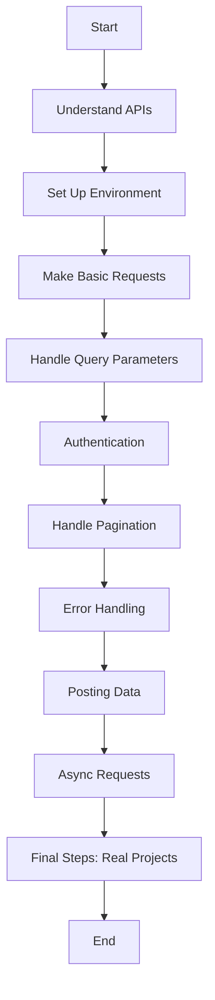

# Learn-Python

# API

# 🚀 Roadmap to Consume an API in Python

## 📌 Introduction
This guide will help you understand how to consume an API in Python, from basic requests to advanced concepts like authentication, pagination, and error handling.

## 📍 Roadmap Diagram


---

## 1️⃣ Understanding APIs
- **What is an API?**
  - API (Application Programming Interface) allows communication between systems.
  - Uses HTTP methods:
    - `GET` → Retrieve data
    - `POST` → Send data
    - `PUT/PATCH` → Update data
    - `DELETE` → Remove data
- **Common Data Formats**
  - JSON (`{ "name": "Isaac", "age": 25 }`)
  - XML (`<name>Isaac</name>`) (less common today)

---

## 2️⃣ Setting Up Your Environment
Install the required library:
```sh
pip install requests
```
Import it in your Python script:
```python
import requests
```

---

## 3️⃣ Making a Basic API Request
```python
import requests

url = "https://jsonplaceholder.typicode.com/posts/1"
response = requests.get(url)

if response.status_code == 200:
    data = response.json()
    print(data)
else:
    print("Error:", response.status_code)
```

---

## 4️⃣ Handling Query Parameters
```python
url = "https://jsonplaceholder.typicode.com/posts"
params = {"userId": 1}

response = requests.get(url, params=params)
print(response.json())
```

---

## 5️⃣ Authentication (API Keys, Tokens, OAuth)
```python
url = "https://api.example.com/data"
headers = {"Authorization": "Bearer YOUR_API_KEY"}

response = requests.get(url, headers=headers)
print(response.json())
```

---

## 6️⃣ Handling Pagination
```python
url = "https://api.example.com/data"
page = 1

while True:
    response = requests.get(url, params={"page": page})
    data = response.json()

    if not data:
        break

    print(data)
    page += 1
```

---

## 7️⃣ Error Handling
```python
try:
    response = requests.get(url)
    response.raise_for_status()
    data = response.json()
    print(data)
except requests.exceptions.RequestException as e:
    print("API Request Error:", e)
```

---

## 8️⃣ Posting Data to an API
```python
url = "https://jsonplaceholder.typicode.com/posts"
payload = {"title": "New Post", "body": "Content", "userId": 1}

response = requests.post(url, json=payload)
print(response.json())
```

---

## 9️⃣ Advanced: Async API Requests
```sh
pip install httpx
```
```python
import httpx
import asyncio

async def fetch_data():
    async with httpx.AsyncClient() as client:
        response = await client.get("https://jsonplaceholder.typicode.com/posts/1")
        print(response.json())

asyncio.run(fetch_data())
```

---

## 🔟 Final Steps: Using APIs in Real Projects
✅ Integrate APIs into web apps (Flask, Django, FastAPI)  
✅ Use APIs for data analysis (Pandas, NumPy)  
✅ Automate tasks (cron jobs, scripts)  

---

## 🎯 Conclusion
Following this roadmap, you can efficiently consume APIs in Python and integrate them into various projects. Happy coding! 🚀
